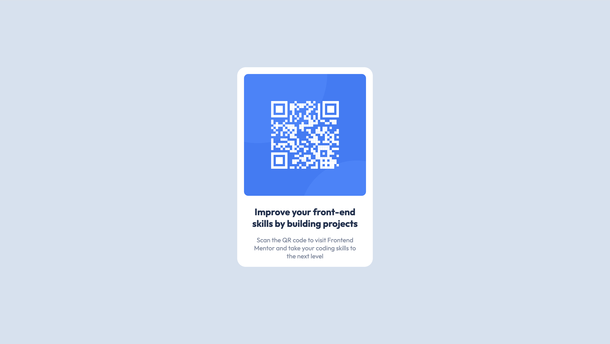

# Frontend Mentor - QR code component solution

This is a solution to the [QR code component challenge on Frontend Mentor](https://www.frontendmentor.io/challenges/qr-code-component-iux_sIO_H). Frontend Mentor challenges help you improve your coding skills by building realistic projects. 

## Table of contents

- [Overview](#overview)
  - [Screenshot](#screenshot)
  - [Links](#links)
- [My process](#my-process)
  - [Built with](#built-with)
  - [What I learned](#what-i-learned)
  - [Continued development](#continued-development)
  - [Useful resources](#useful-resources)
- [Author](#author)
- [Acknowledgments](#acknowledgments)

**Note: Delete this note and update the table of contents based on what sections you keep.**

## Overview

### Screenshot



### Links

- Solution URL: [Add solution URL here](https://github.com/fvdumah/QR-Code)
- Live Site URL: [Add live site URL here](https://your-live-site-url.com)

## My process
I started with writing the html code.
I struggled a lot with figuring out how to centre the card.
There are so many ways listed online however I had issues with most :D
I decided to just stick with flex.

### Built with

- Semantic HTML5 markup
- CSS custom properties
- Flexbox


### What I learned

The main thing I learnt was how important it is to set a height when trying to centre something both vertically and horizontally. I struggled to understand why my card was not vertically centred the way I wanted it. Once I defined the viewport height to a minimum of 100vh. The card became centered.


```css
body {
   display: flex;
    justify-content: center;
    align-items: center;
    min-height: 100vh;
}

```

### Continued development

Use this section to outline areas that you want to continue focusing on in future projects. These could be concepts you're still not completely comfortable with or techniques you found useful that you want to refine and perfect.

**Note: Delete this note and the content within this section and replace with your own plans for continued development.**

## Author

- Website - [Faduma](https://github.com/fvdumah)
- Frontend Mentor - [@fvdumah](https://www.frontendmentor.io/profile/fvdumah)

